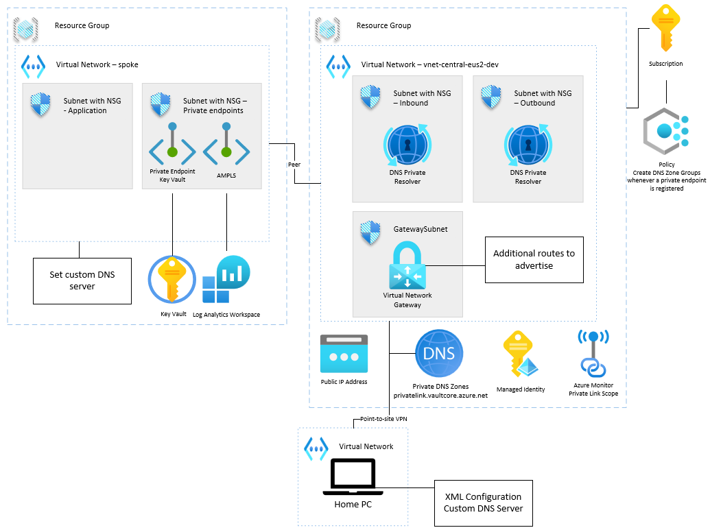

# az-lz-simple



The blog post that reviews this architecture can be found [here](https://jordanbeandev.com/how-to-set-up-a-simple-hub-spoke-network-in-azure/).

## Disclaimer

**THE SOFTWARE IS PROVIDED "AS IS", WITHOUT WARRANTY OF ANY KIND, EXPRESS OR IMPLIED, INCLUDING BUT NOT LIMITED TO THE WARRANTIES OF MERCHANTABILITY, FITNESS FOR A PARTICULAR PURPOSE AND NONINFRINGEMENT. IN NO EVENT SHALL THE AUTHORS OR COPYRIGHT HOLDERS BE LIABLE FOR ANY CLAIM, DAMAGES OR OTHER LIABILITY, WHETHER IN AN ACTION OF CONTRACT, TORT OR OTHERWISE, ARISING FROM, OUT OF OR IN CONNECTION WITH THE SOFTWARE OR THE USE OR OTHER DEALINGS IN THE SOFTWARE.**

## Prerequisites

- [Azure CLI](https://docs.microsoft.com/en-us/cli/azure/install-azure-cli)
- Azure subscription & resource group
- [Azure Developer CLI](https://learn.microsoft.com/en-us/azure/developer/azure-developer-cli/install-azd?tabs=winget-windows%2Cbrew-mac%2Cscript-linux&pivots=os-windows)
- [Azure VPN Client](https://learn.microsoft.com/en-us/azure/vpn-gateway/point-to-site-entra-vpn-client-windows#download)

## Deployment

### Deploy initial infrastructure

1. Run the following Azure Developer CLI command to deploy the infrastructure.

```shell
azd up
```

### Update DNS resolution through Azure VPN client

1. Get inbound IP address of Azure Private Dns Resolver

```shell
az dns-resolver inbound-endpoint show --resource-group <resource-group-name> --dns-resolver-name <dns-private-resolver-name> -n dns-private-resolver-inbound --query "ipConfigurations[0].privateIpAddress"
```

1. [Download](https://learn.microsoft.com/en-us/azure/vpn-gateway/point-to-site-entra-gateway#download) VPN client profile configuration package.

1. Unzip the package & open the `AzureVPN/azurevpnconfig.xml` file.

1. Add DNS inbound IP address to the XML file.

```xml
<AzVpnProfile xmlns:i="http://www.w3.org/2001/XMLSchema-instance" xmlns="http://schemas.datacontract.org/2004/07/">
  ...
  <clientconfig>
	<dnsservers>
    <dnsserver><dns-resolver-inbound-ip-address></dnsserver>
  </dnsservers>
  </clientconfig>
  ...
```

## Create a new spoke vNet and peer it back to the hub

1. Create a spoke vNet.

1. You will need to peer that network back to the hub network. This takes 2 commands to peer both sides.

1. Set up the peer from the spoke vNet to the hub vNet.

```shell
az network vnet peering create -g <resource-group-name> -n <central-virtual-network-name> --vnet-name <virtual-network-name> --remote-vnet /subscriptions/<subscription-id>/resourceGroups/<central-resource-group-name>/providers/Microsoft.Network/virtualNetworks/<central-virtual-network-name> --allow-vnet-access --allow-forwarded-traffic --peer-complete-vnets --use-remote-gateways
```

1. Set up the peer from the hub vNet to the spoke vNet.

```shell
az network vnet peering create -g <central-resource-group-name> -n <virtual-network-name> --vnet-name <central-virtual-network-name> --remote-vnet /subscriptions/<subscription-id>/resourceGroups/<resource-group-name>/providers/Microsoft.Network/virtualNetworks/<virtual-network-name> --allow-vnet-access --peer-complete-vnets --allow-gateway-transit
```

1. You will also need to set a custom DNS server to the IP address of the DNS Private Resolver.

```shell
az network vnet update -g <resource-group-name> --name <virtual-network-name> --dns-servers <dns-resolver-inbound-ip-address>
```

## Test DNS resolution

1. You can test the DNS resolution using PowerShell.

```shell
Resolve-DnsName wa-test-djazhzhdgzb4d0dn.eastus2-01.azurewebsites.net

Name                           Type   TTL   Section    NameHost
----                           ----   ---   -------    --------
wa-test-djazhzhdgzb4d0dn.eastu CNAME  60    Answer     wa-test-djazhzhdgzb4d0dn.eastus2-01.privatelink.azurewebsites.ne
s2-01.azurewebsites.net                                t

Name       : wa-test-djazhzhdgzb4d0dn.eastus2-01.privatelink.azurewebsites.net
QueryType  : A
TTL        : 10
Section    : Answer
IP4Address : 10.0.0.5
```

## Links
