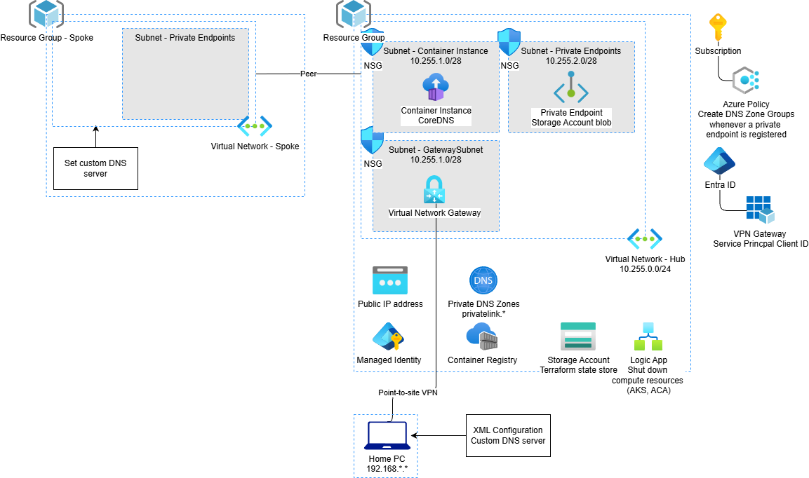

# az-lz-simple

[](https://opensource.org/licenses/MIT)
[](https://learn.microsoft.com/azure/cloud-adoption-framework/ready/landing-zone/)
[](https://learn.microsoft.com/azure/azure-resource-manager/bicep/)
[](https://learn.microsoft.com/azure/developer/azure-developer-cli/)



A simple hub-spoke Azure landing zone deployed with Bicep and Azure Developer CLI. Includes a VPN gateway with Entra ID authentication, a DNS resolver VM running CoreDNS, a GitHub Actions self-hosted runner VM, private DNS zones with Azure Policy auto-registration, scheduled compute start/stop via Logic Apps, and a Storage Account protected by a Network Security Perimeter with a private endpoint.

See [docs/architecture.md](./docs/architecture.md) for the current logical architecture, NSP controls, and traffic paths.

The blog post that reviews this architecture can be found [here](https://jordanbeandev.com/how-to-set-up-a-simple-hub-spoke-network-in-azure/).

## Disclaimer

**THE SOFTWARE IS PROVIDED "AS IS", WITHOUT WARRANTY OF ANY KIND, EXPRESS OR IMPLIED, INCLUDING BUT NOT LIMITED TO THE WARRANTIES OF MERCHANTABILITY, FITNESS FOR A PARTICULAR PURPOSE AND NONINFRINGEMENT. IN NO EVENT SHALL THE AUTHORS OR COPYRIGHT HOLDERS BE LIABLE FOR ANY CLAIM, DAMAGES OR OTHER LIABILITY, WHETHER IN AN ACTION OF CONTRACT, TORT OR OTHERWISE, ARISING FROM, OUT OF OR IN CONNECTION WITH THE SOFTWARE OR THE USE OR OTHER DEALINGS IN THE SOFTWARE.**

## Prerequisites

- [Azure CLI](https://docs.microsoft.com/en-us/cli/azure/install-azure-cli)
- Azure subscription & resource group
- [Azure Developer CLI](https://learn.microsoft.com/en-us/azure/developer/azure-developer-cli/install-azd)
- [Azure VPN Client](https://learn.microsoft.com/en-us/azure/vpn-gateway/point-to-site-entra-vpn-client-windows#download)

## Resources Deployed

| Resource | Description |
|----------|-------------|
| Virtual Network | Hub VNet with Gateway, VM, and Private Endpoint subnets |
| VPN Gateway | Point-to-site VPN with Entra ID (AAD) authentication |
| DNS Resolver VM | Ubuntu VM running CoreDNS forwarding to Azure DNS (168.63.129.16) |
| GitHub Actions Runner VM | Ubuntu VM with self-hosted GitHub Actions runner agent |
| Private DNS Zones | Auto-registered via Azure Policy for private endpoint resolution |
| Azure Policy | Custom policy definition for automatic private DNS zone creation and VNet linking |
| Log Analytics Workspace | Central logging for diagnostics |
| Storage Account | Blob storage with private endpoint and Network Security Perimeter protection |
| Network Security Perimeter | Enforced inbound public access rules for approved `/32` IP addresses |
| Logic Apps | Scheduled start/stop of compute resources (VMs, AKS, Container Apps, Function Apps) |
| Managed Identity | User-assigned identity for policy remediation and compute management |
| Role Assignments | Subscription-scoped roles for the managed identity |

## Environment Variables

Set these `azd` environment variables before running `azd up`:

| Variable | Required | Description |
|----------|----------|-------------|
| `AZURE_RESOURCE_GROUP_NAME` | Yes | Name of the pre-created resource group |
| `AZURE_ADMIN_USERNAME` | Yes | Admin username for VMs |
| `AZURE_ADMIN_PASSWORD` | Yes | Admin password for the DNS resolver VM |
| `AZURE_GITHUB_REPO_URL` | Yes | GitHub repo URL for the Actions runner (e.g. `https://github.com/org/repo`) |
| `AZURE_GITHUB_PAT` | Yes | Fine-grained GitHub PAT with runner registration permissions |
| `AZURE_GITHUB_ACTIONS_ADMIN_PUBLIC_KEY` | Yes | SSH public key for the GitHub Actions runner VM |
| `AZURE_ALLOWED_INBOUND_IP_ADDRESSES` | No | Comma-separated approved inbound `/32` IP addresses for the storage account's NSP |
| `AZURE_NSP_ACCESS_MODE` | No | NSP association mode: `Enforced` by default; `Learning` is available for transition/testing |

## Deployment

### Deploy initial infrastructure

1. Create a resource group and set the AZD env var to the resource group name.

```shell
az group create --name <resource-group-name> --location <location>

azd env set AZURE_RESOURCE_GROUP_NAME <resource-group-name>
```

1. Check the `infra/main.parameters.json` file and update the parameters as needed.

1. Run the following Azure Developer CLI command to deploy the infrastructure.

```shell
azd up
```

### Update DNS resolution through Azure VPN client

1. Get the private IP address of the DNS resolver VM (configured via `dnsResolverVm.privateIPAddress` in `main.parameters.json`).

1. [Download](https://learn.microsoft.com/en-us/azure/vpn-gateway/point-to-site-entra-gateway#download) VPN client profile configuration package.

1. Unzip the package & open the `AzureVPN/azurevpnconfig.xml` file.

1. Add DNS IP address to the XML file. You may have to update the `<clientconfig>` section to include the `<dnsservers>` element with the inbound IP address of the DNS server. The XML should look like this afterwards.

```xml
<AzVpnProfile xmlns:i="http://www.w3.org/2001/XMLSchema-instance" xmlns="http://schemas.datacontract.org/2004/07/">
  ...
  <clientconfig>
	<dnsservers>
    <dnsserver><dns-server-ip-address></dnsserver>
  </dnsservers>
  </clientconfig>
  ...
```

## Create a new spoke vNet and peer it back to the hub

1. Create a spoke vNet.

1. You will need to peer that network back to the hub network. This takes 2 commands to peer both sides.

1. Set up the peer from the spoke vNet to the hub vNet.

```shell
az network vnet peering create -g <resource-group-name> -n <central-virtual-network-name> --vnet-name <virtual-network-name> --remote-vnet /subscriptions/<subscription-id>/resourceGroups/<central-resource-group-name>/providers/Microsoft.Network/virtualNetworks/<central-virtual-network-name> --allow-vnet-access --allow-forwarded-traffic --peer-complete-vnets --use-remote-gateways
```

1. Set up the peer from the hub vNet to the spoke vNet.

```shell
az network vnet peering create -g <central-resource-group-name> -n <virtual-network-name> --vnet-name <central-virtual-network-name> --remote-vnet /subscriptions/<subscription-id>/resourceGroups/<resource-group-name>/providers/Microsoft.Network/virtualNetworks/<virtual-network-name> --allow-vnet-access --peer-complete-vnets --allow-gateway-transit
```

1. You will also need to set a custom DNS server to the IP address of the DNS Private Resolver.

```shell
az network vnet update -g <resource-group-name> --name <virtual-network-name> --dns-servers <dns-server-ip-address>
```

## Test DNS resolution

1. You can test the DNS resolution using PowerShell.

```shell
Resolve-DnsName wa-test-djazhzhdgzb4d0dn.eastus2-01.azurewebsites.net

Name                           Type   TTL   Section    NameHost
----                           ----   ---   -------    --------
wa-test-djazhzhdgzb4d0dn.eastu CNAME  60    Answer     wa-test-djazhzhdgzb4d0dn.eastus2-01.privatelink.azurewebsites.ne
s2-01.azurewebsites.net                                t

Name       : wa-test-djazhzhdgzb4d0dn.eastus2-01.privatelink.azurewebsites.net
QueryType  : A
TTL        : 10
Section    : Answer
IP4Address : 10.0.0.5
```

## GitHub Actions Self-Hosted Runner

The deployment includes a GitHub Actions self-hosted runner VM within the hub VNet. The runner is provisioned as an Ubuntu VM with the GitHub Actions runner agent installed via cloud-init and registered as a systemd service.

Features:
- **Private network isolation** — runs within the hub VNet on the VM subnet
- **Persistent runner** — runs as a systemd service that auto-restarts
- **Pre-installed tooling** — Docker, Python 3, Git, curl, jq, openssh-client

The runner is configured via the following `azd` environment variables (set before running `azd up`):

```shell
azd env set AZURE_GITHUB_REPO_URL "https://github.com/<org-or-username>/<repository-name>"
azd env set AZURE_GITHUB_PAT "<your-fine-grained-pat>"
azd env set AZURE_GITHUB_ACTIONS_ADMIN_PUBLIC_KEY "<ssh-public-key>"
```

## Network Security Perimeter

A [Network Security Perimeter](https://learn.microsoft.com/azure/private-link/network-security-perimeter-concepts) (`nsp-{resourceToken}`) is deployed into the central resource group. The storage account (used for Terraform state) is associated with the perimeter, and a `default` profile carries an inbound access rule listing the approved public IP addresses.

The approved IP list is **not** checked into source control — it is read from the `azd` environment as a comma-separated list of `/32` CIDRs:

```shell
azd env set AZURE_ALLOWED_INBOUND_IP_ADDRESSES "203.0.113.10/32,198.51.100.25/32"

# Optional transition mode. Enforced is the default and blocks non-approved public traffic.
azd env set AZURE_NSP_ACCESS_MODE "Enforced"
```

The storage account uses `publicNetworkAccess: SecuredByPerimeter`, and its NSP association is `Enforced` by default. In Enforced mode, the NSP is the authoritative public-network control; the storage account firewall and trusted-service exceptions do not override it. Private endpoint traffic is not subject to NSP rules.

If the IP variable is unset or empty, no inbound public access rule is created and public data-plane access is denied. Keep the list current when your workstation or automation egress IP changes.

The NSP resource is deployed in the central resource group and currently associates the Terraform-state storage account. To inspect the live configuration:

```shell
az storage account show -g <central-resource-group> -n <storage-account-name> \
  --query "{publicNetworkAccess:publicNetworkAccess,networkRuleSet:networkRuleSet}" -o json

az rest --method get \
  --url "https://management.azure.com/<nsp-resource-id>/resourceAssociations?api-version=2024-07-01"
```

See [docs/architecture.md](./docs/architecture.md) for the logical topology and traffic paths.

## IPAM — Spoke VNet Provisioning

A VS Code task-driven tool for creating spoke VNets peered to the hub. Run tasks from the Command Palette (`Ctrl+Shift+P` → `Tasks: Run Task`):

| Task | Description |
|------|-------------|
| IPAM: Discover available address space | Scans all VNets in the subscription and suggests available CIDR blocks |
| IPAM: Provision new spoke VNet | Creates VNet, subnets, bidirectional peering, and sets hub DNS |
| IPAM: Provision spoke (dry run) | Preview mode — shows commands without executing |
| IPAM: List spoke VNets | Shows all hub peerings and VNets |
| IPAM: Remove spoke VNet | Removes peerings and optionally deletes VNet/RG |

### Setup

```shell
cp .azure-debug-config.example.json .azure-debug-config.json
# Edit .azure-debug-config.json with your hub VNet, DNS server, and subscription details
```

## Network Debugging

Diagnostic scripts for troubleshooting WSL2 → VPN → Azure connectivity. Available as VS Code tasks (prefixed with "Debug:") and as CLI scripts in `scripts/debug/`.

| Task | Description |
|------|-------------|
| Debug: Run all diagnostics | Full suite — VPN, DNS, peerings, endpoints |
| Debug: Check VPN connection | VPN routes, gateway health, Windows adapter |
| Debug: Check DNS resolution | DNS resolution test for a hostname |
| Debug: Check DNS server VM | CoreDNS VM power state and health |
| Debug: Restart DNS server VM | Start the DNS VM if it was stopped |
| Debug: Check VNet peerings | Hub↔spoke peering state and flags |
| Debug: Check private DNS zones | Zone existence and VNet links |
| Debug: Check private endpoints | PE connection status and DNS |

### Azure MCP Server

This repo includes an [Azure MCP Server](https://github.com/mcp/com.microsoft/azure) configuration (`.vscode/mcp.json`) that gives Copilot native access to Azure resources. When running in Agent Mode, Copilot can query VNets, peerings, DNS zones, and private endpoints directly — no `az` CLI needed for read operations.

**Prerequisites**: Node.js (for `npx`), Azure CLI logged in (`az login`).

The MCP server starts automatically when VS Code detects the configuration. No extra installation needed.

### Copilot Agents

This repo includes custom GitHub Copilot agents you can invoke in Copilot Chat:

- **`@network-troubleshooter`** — Systematically diagnoses connectivity problems (VPN, DNS, peering, private endpoints) using the debug scripts, Azure CLI, and Azure MCP Server tools.
- **`@ipam`** — Walks you through provisioning a new spoke VNet: discovers available address space, designs a subnet plan, runs a dry-run, provisions with peering and DNS, and verifies. Uses Azure MCP Server for read queries.
